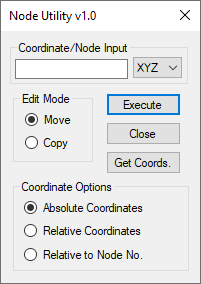

# Robot - Node Utility

This extension for Robot Structural Analysis (RSA) was developed to provide an easier way of aligning and editing nodes than what was allowed in the default interface.

The extension has been tested with RSA 2019 and upwards, but may work for older versions.

## Changelog

### v1.0

* Initial public release

## Building

In order to build this project, the Robot SDK must be installed on the system. This can be found in the Robot installation folder, C:\Autodesk\<Robot Installer Folder>\x64\Tools\RSASDK
